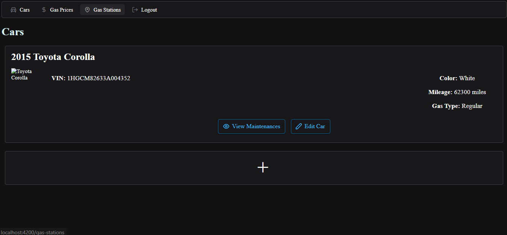
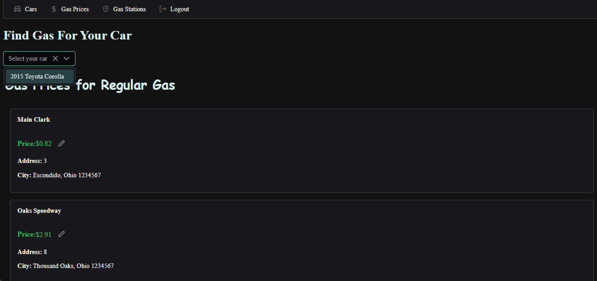
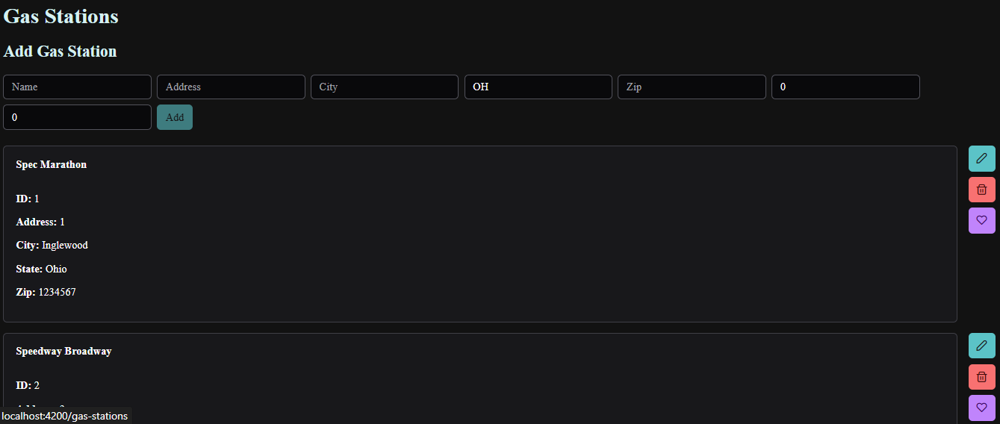
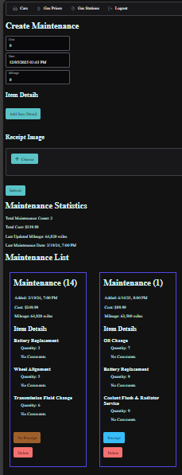

# Karto

## Overview

This application provides a way for car owners to help manage their vehicles through keeping track of their previous maintenance work, allow them to find nearby trusted gas stations, and keep track of some of their vehicles' information.

## Description

- Allows for a user to login to their account through a quality interface.
- Provides a home page that shows the user their cars.
- Provides a way for users to track and update their maintenance history on each of their cars.
- Allows users to add or look up gas stations that they trust.

## Goals

- Provide an easy way for users to keep track of their cars.
- Provide a tracker of the users' car maintenance histories.
- Provide users with locations of trusted gas stations and their gas prices.

## Screenshots

### Home Page

### Gas Prices

### Gas Stations

### Maintenances

## Presentation

[PDF](Business%20Requirements/Karto%20Project%20Presentation.pdf)

[PPTX](Business%20Requirements/Karto%20Project%20Presentation.pptx)

## Project Composition

### [MVP](Business%20Requirements/MVP.md)

Describes the minimum features of the application.

### [UI/UX Design](UIUX)

Describes the planned User Interface and User Flows for the application.

### [Database Design](Database-Design)

Describes the database used for the application.

### [API Repository](https://github.com/payne1778/cs4900-api-karto)

The code for the backend server used.

### [Web Design Repository](https://github.com/payne1778/cs4900-ui-karto)

The code for the frontend that the user sees in the user interface.

## Team Members

- Joshua Quaintance
- Joshua Wise
- Owen Kemp
- Blake Payne
