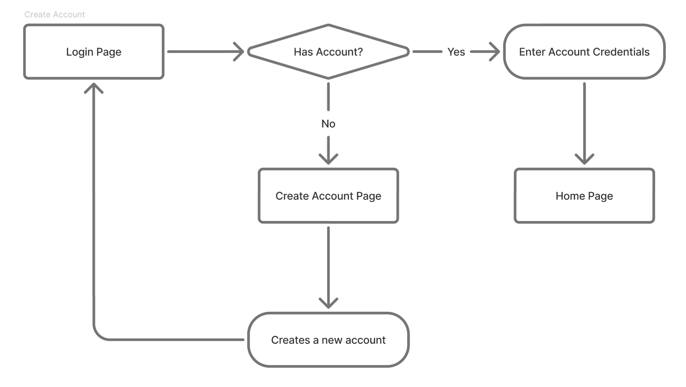
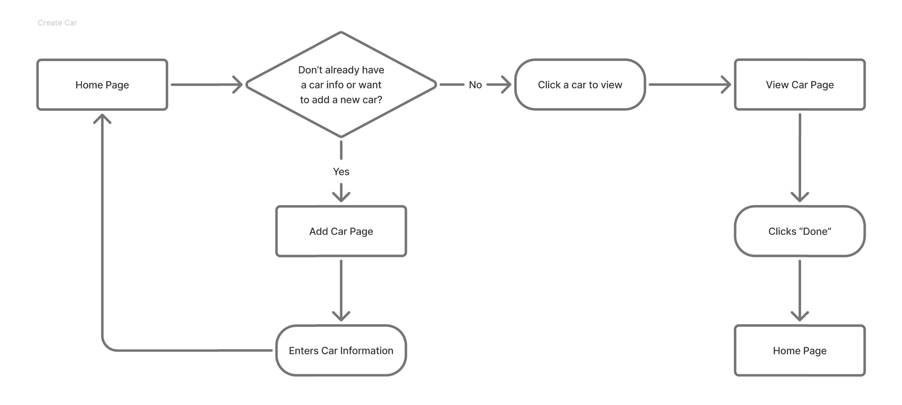
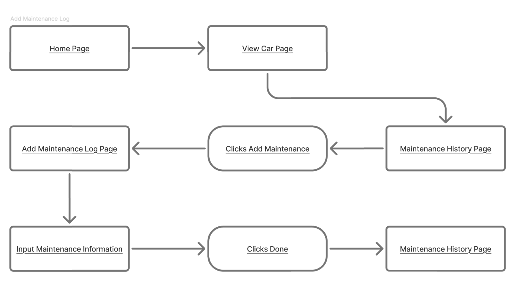
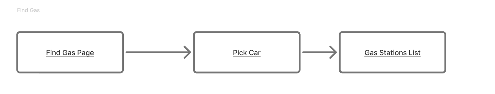
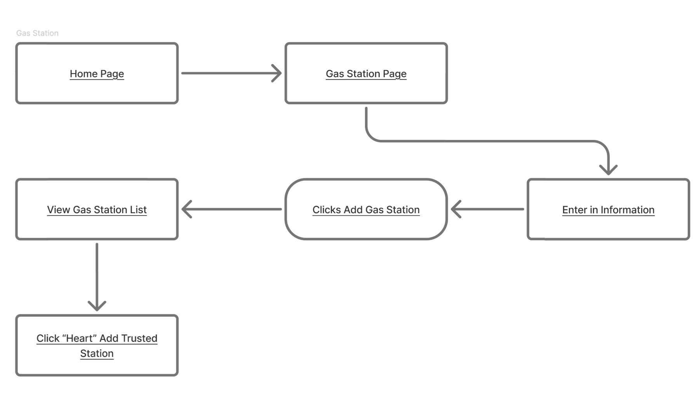
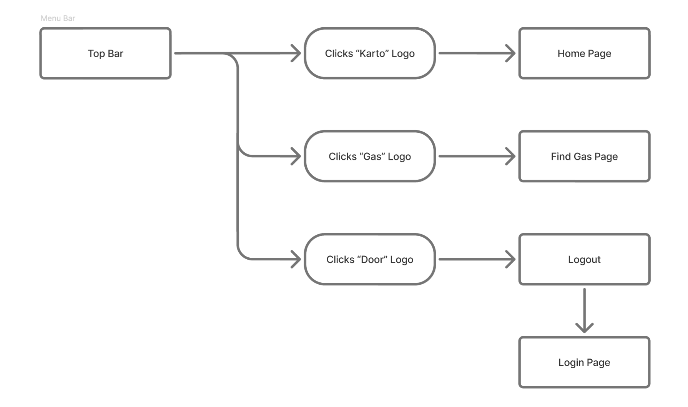
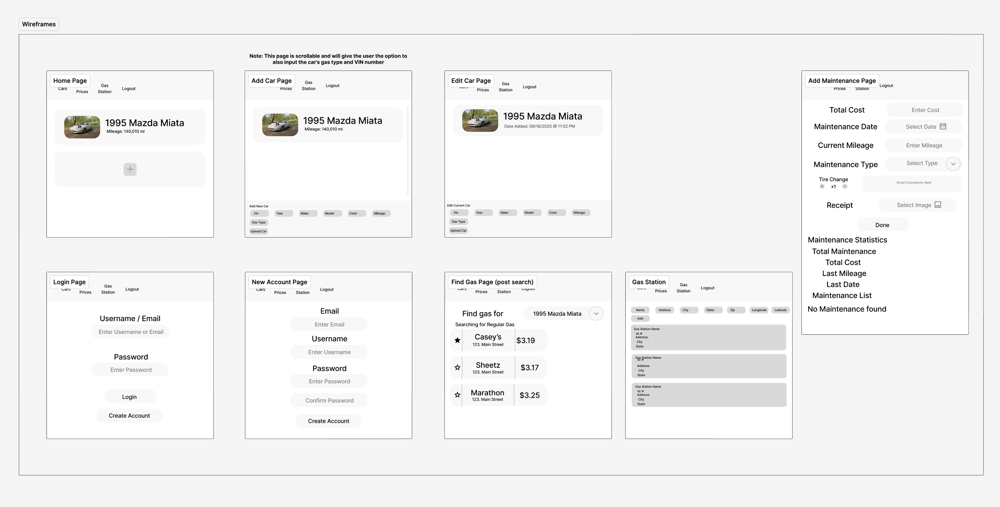
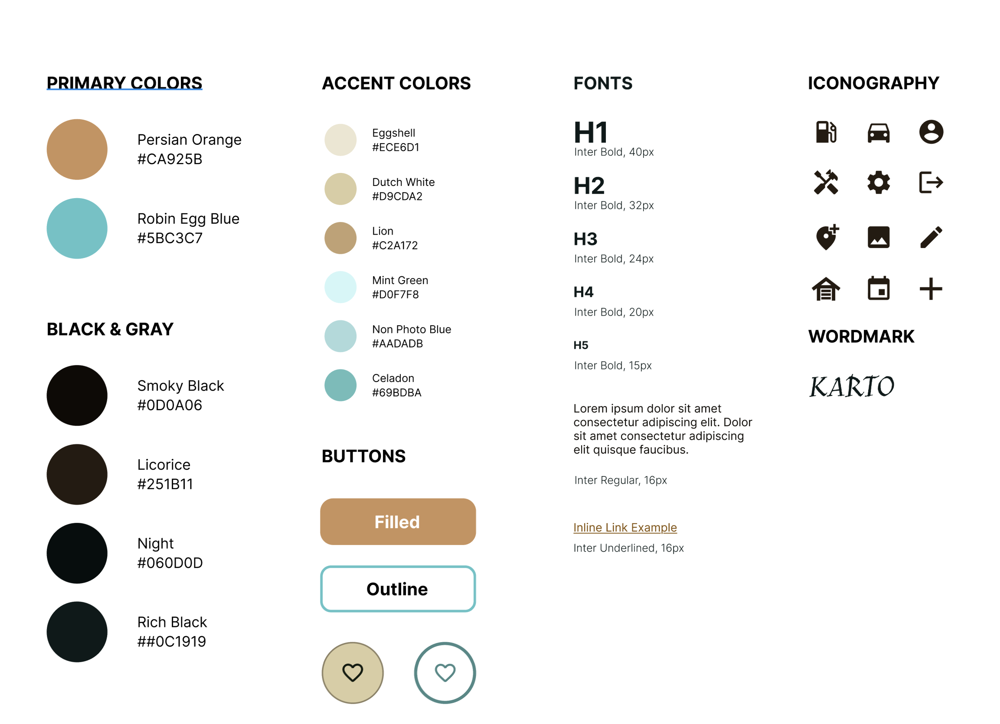

# UI/UX

## Userflows

#### Authentication

On login if user has an account then credentials are entered and redirected to the homepage. If a user does not have an account the user is redirected and prompted to enter in credentials to make a new account. Then redirected back to login to reinput information to login and move towards the home page.

#### Add Car

On homepage if the user does not have a car the "Add car" button is the only button pressable. Then a popup appears making the user enter in various car information. Once the car is created the user is then the popup is closed and now that car pops up alongside the option to add an additional car.

### Add Maintenance Log

Starting from the home page, pressing on any car option redirects to the maintenance history page. Which allows the user to add maintenance and input it. The input maintenance information is selected based on a dropdown menu that the user can then select multiple different options depending on the maintenance done. Then adding a description for specifics under that category and adding a reciept or image for records.

### Find Gas

The user presses the gas button then a list of gas stations appear with the option to edit gas prices per gas station based on the user inputted data from gas stations.

### Gas Stations

The user can enter in information to track and add gas stations from various locations that can be starred or added as trusted gas stations.

### Menu Bar

The top bar has four buttons, Cars which redirects the user to their cars, gas stations which is where the user can view gas stations, gas prices where the user can view gas prices then logout if logged in. If the user has not logged in they can only see the login and logout buttons.

---

## Wireframes

#### Add Car

Under Add car the user inputs the following,

- Manufacturer
- Make
- Year
- Vin
- Mileage
- Color
- Photo

To track, monitor and maintain their vehicle.

#### View Car and Maintenance

Allowing users to visualize current miles, selected gas types and any extra stored traits.

Maintenance page has the options for,

- Maintenance Date
- Current Mileage
- Reciept
- Total Cost
- Maintenance Type (Dropdown of selected maintenance options)
- Comments Section
- Tires changed

#### Account Create

If the user has not created account and pressed "Create Account" the following options are available for input,

- Email
- Username
- Password
- Confirm password

Where the password is hashed with a salt.

Logging in the user has the options for,

- Username/Email
- Password

#### Find Gas

On view

Find gas has listed gas stations in the selected area sorted by favorite.

## Branding Guide

#### Colors

The two primary colors are chosen to be somewhat dull and old to match that vintage car feeling for the entire app, with the accent being slight variations of these main colors. The neutral blacks and grays also follow the same 2 main colors with alterations towards the black.

#### Buttons

There will be three types of buttons, which the first two are regular buttons that users are used to with a Filled and Outline variations that has their different uses throughout the applications.

The other style is an icon button, where the main content of the buttons is simply an icon to indicate what the button is going to do. This is great for use on simple well known actions that the user will do a lot, like adding a new maintenance log, etc. This style too come with bot the filled and the outline variation.

The last one would be a simple combination of both, where the icons will be paired with the text to keep the personality of the app using the icons but still clarify what the buttons is going to achieve mostly for the actions that the user won't be doing too much of, for example, editing a car information.

#### Fonts

We used the font Inter for readability and the customizability of the font itself, stretching from boldness to italics and underlines, this will fit the application of being simplistic but still being accessible for the user.

#### Iconography

For the Icons, we decided to use the Material Design icons by Google as it is an established icon library that ensured a meaningful graphic for what the icon is trying to imply. They too come with different variations, from Outlined, Filled, Rounded, and Two-Toned, and by choosing Material Design we can ensure that our icons will be consistent throughout the different menus.

#### Tone & Personality

Finally, the overall feel of the app will have an old somewhat dull and old personality just like the cars that will be tracked with. This will help the user have that feeling of nostalgia and age in the app itself complementing their vintage. The two-tone dull dark orange and pastel blue even throughout the accent colors consistent with the goal of the personality.
